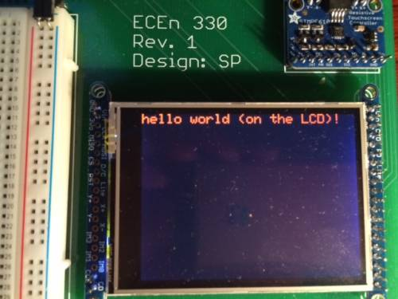
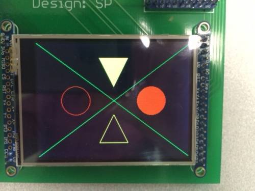

# Lab 1: Hello World on the 330 Board

## Objectives
* Start to learn how to use the Xilinx SDK and to download and run programs on the 330 board.
* Learn to use the SDK by exploring it. Learn how to: 
    1. edit and save programs,
    2. practice running programs,
    3. explore the graphics library,
    4. experiment with the SDK to learn what it can do.
* Become familiar with the graphics routines that are available for use with the LCD display.
* Learn some of the issues with printf().

## Goals
* Print "hello world" on the Zybo Board

* Read the graphics documentation and then modify the “helloWorld.c” program so that it shows the following when executed (both triangles are yellow)
