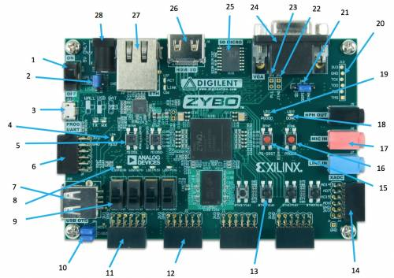
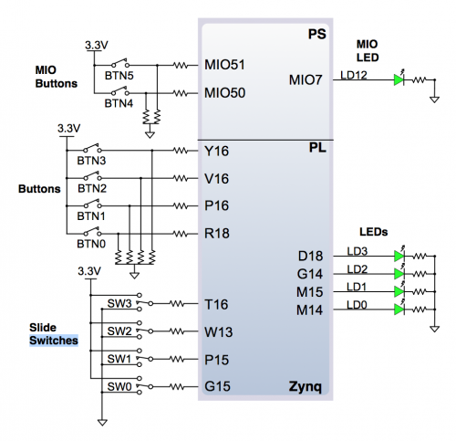

# Lab 2: Writing Driver Software for the Slide Switches and Push Buttons

## Objectives
* Gain practice and experience with the Xilinx SDK.
* Gain experience with commercial documentation.
* Understand how the GPIO IP block functions and write low-level code to communicate with it (instead of using the functions provided by xgpio.h).
* Learn how to write low-level software to interface with buttons and switches.
* Practice applying the class coding standard.
* Write reusable code that you may use in later labs.
* Write test code that demonstrates the correctness of your implementation and that demonstrates how to use the button/switch software driver that you wrote.
* Gain additional practice with the graphic library and the LCD.

## Zybo Board

## Schematic for Buttons and Switches

## Goals

