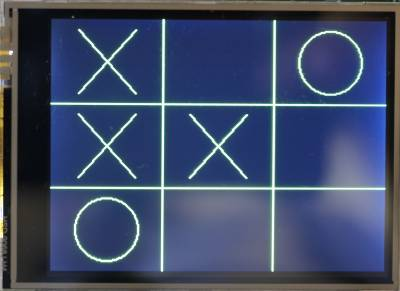

# Lab 7: Unbeatable Tic Tac Toe

## Overview
* **Algorithm**. You will write the software that makes it impossible to beat the computer.
* **Display**. You will write the routines that implement the Tic-Tac-Toe board and the drawing of the X's and the O's.
* **Control**. You will implement the game control using the state-machine concepts discussed in the class, similar to what you did for the clock lab.

## Objectives

* Practice developing your own state diagrams.
* More practice implementing synchronous state machines.
* Practice implementing and debugging your synchronous controller state machine.
* Gain more experience using the touch-controller and graphics library.
* Develop your own state-diagram for control and implement it using the synchronous state-machine techniques discussed in class.
* Implement a recursive mini-max algorithm and use it to create an unbeatable game of tic-tac-toe.

## Game Design

## Goal (Video)

