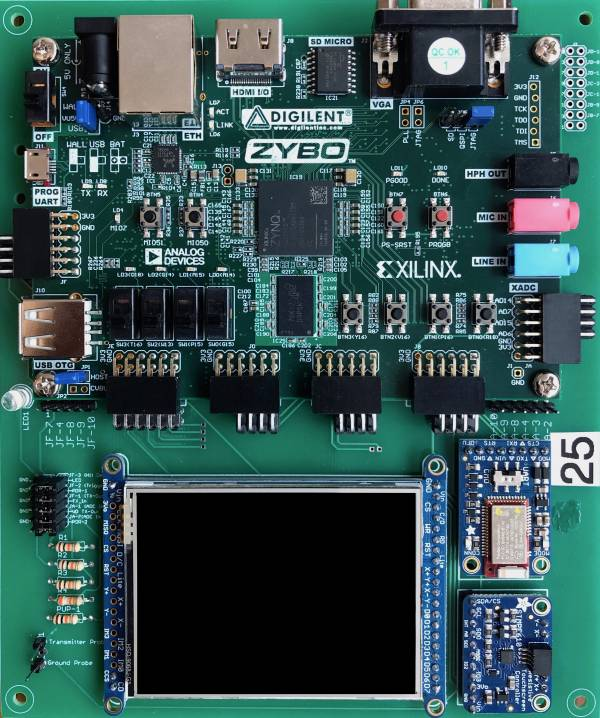

# Embedded Systems Class

## Goals

* Acquire deep knowledge of the C programming language.
* Learn simple software engineering techniques.
* Practice writing code that meets a coding standard.
* Practice implementing different implementation styles.
* Learn how to reactive code (the basis for embedded systems).

Become capable of independently writing embedded software for your own creation!

## Projects
1. **helloWorld on ZYBO Board**
2. **Driver for Slide Switches and Push Buttons**
3. Interval Timers
4. Clock
5. **Unbeatable Tic Tac Toe**
6. Simon Game
7. Whack A Mole
